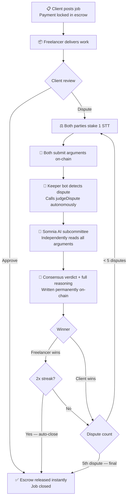
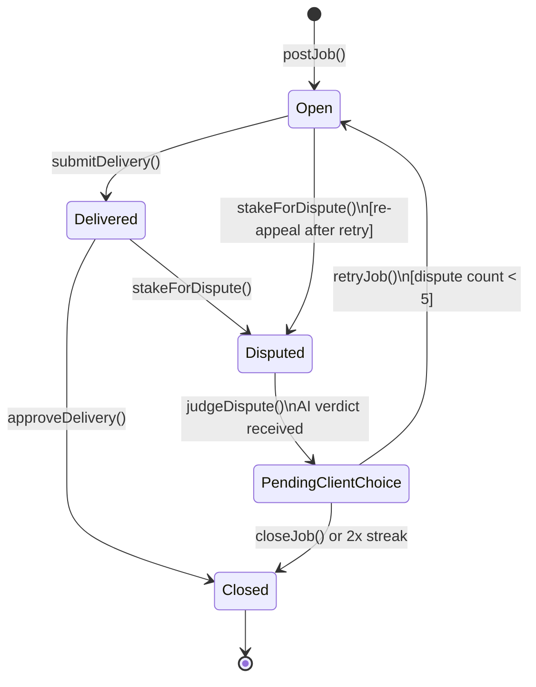

<div align="center">
  
  <h1>Abita</h1>
  <p><strong>On-chain AI dispute resolution for the trustless freelance economy.</strong></p>

  <p>
    <a href="https://abita-eight.vercel.app/">🌐 Live App</a> &nbsp;·&nbsp;
    <a href="https://www.youtube.com/watch?v=Zs37k8gubA4">🎥 Demo Video</a> &nbsp;·&nbsp;
    <a href="https://shannon-explorer.somnia.network/address/0x36471F4a5054886fdA2B9D8f08436d0662d06907">📋 Smart Contract</a>
  </p>

  <br />

  
  
  
  
</div>

---

## The Problem

Freelancers lose tens of billions to payment disputes every year. Clients get burned by undelivered work. When a disagreement happens online — across borders, across time zones — there is nowhere to turn.

Centralized arbitration is slow, expensive, and biased. Peer resolution is a popularity contest. And most "escrow" platforms still depend on a human deciding who is right.

**There had to be a better way.**

---

## What is Abita?

Abita is a trustless freelance escrow platform where disputes are resolved by a subcommittee of three AI validators — running natively on the Somnia Agentic L1 — who independently evaluate both sides and deliver a binding consensus verdict, on-chain, with full written reasoning.


<br />

No human arbitrators. No appeals to a faceless support team. No waiting. Just code.

---

## How It Works



### Contract State Machine



---

## Agent-Native Design

Abita is not a platform with AI bolted on. It is built ground-up on Somnia's Agentic L1 infrastructure — every dispute resolution is a live on-chain AI event.

### The AI Subcommittee

When a dispute is raised, Abita invokes a subcommittee of three AI validators on the Somnia network. The subcommittee receives the complete context in a single structured prompt:

- The original job requirements
- The freelancer's delivery note
- The client's dispute argument
- The freelancer's counter-argument

The validators independently evaluate the case and return a consensus verdict with full written reasoning:

```json
{
  "winner": "0x...",
  "reason": "The delivery note demonstrates completion of all stated requirements. The client's argument raises timeline concerns, however the original job spec contained no deadline clause..."
}
```

The consensus winner is paid. The full reasoning is written permanently to the Somnia blockchain — auditable by anyone, forever, via the Somnia Agent Explorer.

### Constrained Output — A Novel Use of Somnia Primitives

Standard LLM responses are non-deterministic and free-form — unusable for executing smart contracts directly. Abita uses Somnia's agent primitives to constrain AI output into a deterministic JSON structure that `handleResponse` can parse and execute immediately.

The AI reasons with full freedom. But its output is machine-readable. This is the bridge between probabilistic AI and deterministic contract execution.

### Fully Permissionless Invocation

`judgeDispute` is callable by any address. There is no owner gate, no whitelist, no admin key. The system is censorship-resistant by design — anyone can trigger the AI judges on a disputed job.

---

## Autonomous Performance

Once both parties submit their arguments, **no human needs to touch the system again.**

### The Keeper Bot

A lightweight Node.js keeper bot watches the Somnia chain for jobs in `Disputed` status and autonomously calls `judgeDispute`:

```
npm run keeper
```

```
[Keeper] Scanning for disputed jobs...
[Keeper] Found job #1 in Disputed state
[Keeper] Calling judgeDispute autonomously...
[Keeper] Transaction confirmed: 0x...
[Keeper] AI judges invoked. Waiting for callback.
```

From argument submission to verdict execution, the full loop runs without any human trigger:

```
submitArgument() ──► Keeper detects Disputed ──► judgeDispute() [autonomous]
       ──► Somnia callback ──► handleResponse() ──► winner paid ──► job closed
```

### The Streak Mechanic — Autonomous De-escalation

If a freelancer wins two consecutive disputes on the same job, Abita automatically closes the job and releases the escrow — without requiring client action. This prevents bad-faith dispute loops and is enforced entirely in the contract.

---

## Key Innovations

| # | Innovation | Detail |
|---|---|---|
| 1 | **Binding AI verdicts** | Probabilistic AI constrained into deterministic contract execution via structured JSON output |
| 2 | **On-chain reasoning audit** | Full AI reasoning stored permanently on Somnia — not just the outcome |
| 3 | **Autonomous de-escalation** | Streak mechanic auto-closes jobs after 2 consecutive freelancer wins — no human action required |
| 4 | **Permissionless AI invocation** | `judgeDispute` is callable by any address — no admin gate, fully censorship-resistant |
| 5 | **Keeper-driven autonomy** | End-to-end autonomous loop — zero human intervention after argument submission |
| 6 | **Dual staking** | Both parties stake 1 STT to raise a dispute — aligns incentives and deters bad-faith claims |

---

## Tech Stack

| Layer | Technology |
|---|---|
| Smart Contract | Solidity, Hardhat |
| AI Inference | Somnia Agentic L1 |
| Frontend | Next.js 16, Tailwind v4, shadcn/ui, Framer Motion |
| Web3 | wagmi v2, viem |
| Automation | Node.js keeper bot |
| Network | Somnia Testnet |

---

## Smart Contract

| | |
|---|---|
| **Contract** | `AbiCore.sol` |
| **Network** | Somnia Testnet (Shannon) |
| **Address** | `0x36471F4a5054886fdA2B9D8f08436d0662d06907` |
| **Explorer** | [View on Shannon Explorer](https://shannon-explorer.somnia.network/address/0x36471F4a5054886fdA2B9D8f08436d0662d06907) |

---

## Getting Started

### Prerequisites

- Node.js 18+
- A Somnia Testnet wallet funded with STT — [get STT from the faucet](https://cloud.google.com/application/web3/faucet/somnia/shannon)
- MetaMask or any EVM-compatible wallet

### 1. Clone the repository

```bash
git clone https://github.com/abrahamebij/abita
cd abita
```

### 2. Install dependencies

```bash
# Root — contracts + keeper bot
npm install

# Frontend
cd frontend && npm install && cd ..
```

### 3. Configure environment variables

Create a `.env` file in the project root:

```env
# Keeper bot wallet private key (with 0x prefix — never expose this publicly)
PRIVATE_KEY=0xyour_keeper_wallet_private_key

# Deployed AbiCore contract address on Somnia Testnet
ABICORE_ADDRESS=0x36471F4a5054886fdA2B9D8f08436d0662d06907
```

> The frontend contract address is configured in `frontend/lib/config.ts`.

### 4. Add Somnia Testnet to your wallet

| Field | Value |
|---|---|
| Network Name | Somnia Testnet |
| RPC URL | `https://dream-rpc.somnia.network` |
| Chain ID | `50312` |
| Currency Symbol | `STT` |
| Block Explorer | `https://shannon-explorer.somnia.network` |

### 5. Run the frontend

```bash
cd frontend
npm run dev
```

Open [http://localhost:3000](http://localhost:3000) in your browser.

### 6. Run the keeper bot

Back in the root directory, open a separate terminal:

```bash
npm run keeper
```

The keeper bot will scan for jobs in `Disputed` status every 30 seconds and autonomously call `judgeDispute` — no manual intervention needed.

---

## Demo

| | |
|---|---|
| 🎥 **Demo Video** | [Watch on YouTube](https://www.youtube.com/watch?v=Zs37k8gubA4) |
| 🌐 **Live App** | [abita-eight.vercel.app](https://abita-eight.vercel.app/) |
| 📋 **Smart Contract** | [Shannon Explorer](https://shannon-explorer.somnia.network/address/0x36471F4a5054886fdA2B9D8f08436d0662d06907) |
| 🧠 **On-chain Verdict** | [Somnia Agent Receipt Example](https://agents.testnet.somnia.network/receipts/5896707) |

---

## Built For

**[Somnia Agentathon](https://www.encodeclub.com/programmes/agentathon)** — Build the most novel and high-impact agent-driven application on Somnia.

Built by **Abraham Ebijuni**
