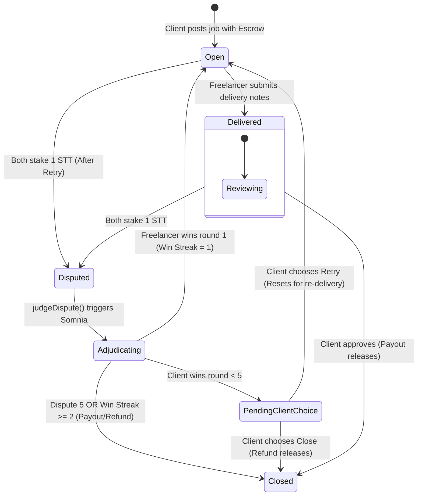

# Solidity Contract Design Directives & Somnia AI Integration

This document outlines the architectural decisions, design patterns, and platform interfaces implemented in the Abita smart contracts layer (`AbiCore.sol` and `ISomniaAgents.sol`).

---

## 1. Architectural Decisions

### Lowercase Hexadecimal Address Comparison (Short-Circuit Mapping)
The Somnia on-chain LLM Agent takes a prompt and allowed string outputs, and returns the selected winner as a string. Instead of importing an expensive and complex string-to-address conversion library in Solidity, we use OpenZeppelin's `Strings.toHexString(uint160(address), 20)` to format the lower-level hex addresses of both the client and freelancer.
When the platform triggers the callback, we format both wallet addresses and perform a direct lowercase hex string comparison (`keccak256(abi.encodePacked(...))`). This is gas-efficient and 100% deterministic.

### Double-Stake Commitment for Disputes
Every dispute consumes 2 STT in judging costs. Rather than allowing one party to force a dispute without skin in the game, both the Client and the Freelancer must stake exactly 1 STT to activate the `Disputed` status. 
Funds are escrowed directly in the contract, and upon resolution, the treasury receives the full 2 STT fee to sustain the platform business model.

### Re-Entrancy Prevention
State status changes (e.g. flipping to `Closed`) are executed *before* making low-level transfers (`.call{value: ...}("")`). This prevents re-entrancy attacks.

---

## 2. Job States and Transitions

The lifecycle of each job is modeled as follows:



---

## 3. Somnia AI Agent Interface

### Agent Platform Contract
- **Testnet Contract Address:** `0x037Bb9C718F3f7fe5eCBDB0b600D607b52706776`
- **Agent Platform Interface (`ISomniaAgents.sol`):**
```solidity
interface ISomniaAgents {
    function getRequestFee(uint256 agentId, uint8 agentVersion) external view returns (uint256);
    function createRequest(
        uint256 agentId,
        address callbackAddress,
        bytes4 callbackSelector,
        bytes calldata payload
    ) external payable returns (uint256);
}
```

### Prompt Engineering payload structure
The LLM Inference Agent is invoked with the following parameters:
- `agentId`: `12847293847561029384` (consensus-verified Qwen3-30B model)
- `systemPrompt`: Strict, guiding instructions declaring the role of arbitrator and output format constraints.
- `userPrompt`: Details of requirements, delivery notes, and arguments.
- `allowedValues`: List containing `[clientHex, freelancerHex]` to ensure type safety and deterministic choice.
